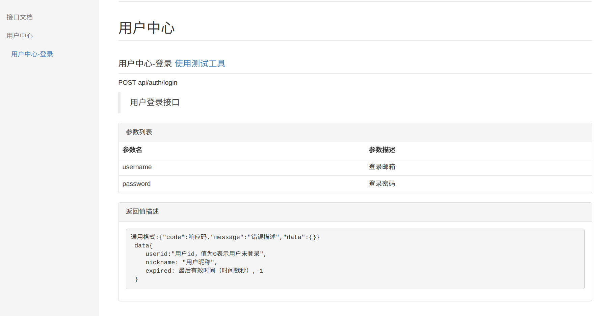
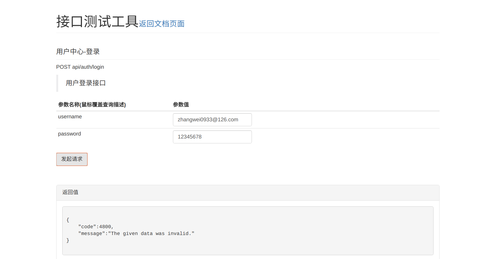

# larvel接口文档生成,测试工具生成工具
> 目前已经是基本可用版本，不过测试工具返回类型只有json类型

# 基本使用方法
1. composer 安装包:
  > composer require --dev orangesir/larvel-doc:dev-master
2. 配置服务提供者, config/app.php
  > 'providers' => [ Apidoc\ApiDocServiceProvider::class ]
3. 在controller方法上编写文档,具体编写见下面"文档编写规则"
4. 生成文档(生成前会删除所有文档):
  php artisan doc:generate
5. 查看文档: http://project-domain/docs/index.html
6. 清空所有文档:
  php artisan doc:cleanall

# 基本用法生成物描述
生成物包含文档页和测试工具页，下面是截图: 
文档图片:

工具图片:

# 文档编写方法：
### 基本模板
<pre>
    /**
     * @Name 用户中心-登录
     * @Description 用户登录接口
     * @Param username:登录邮箱 @ParamTest zhangwei0933@126.com
     * @Param password:登录密码 @ParamTest 12345678
     *
     * @Response 通用格式:{"code":响应码,"message":"错误描述","data":{}}
     * data{
     *    userid:"用户id，值为0表示用户未登录",
     *    nickname: "用户昵称",
     *    expired: 最后有效时间（时间戳秒）,-1
     * }
     */
     public function login(Request $request){}
</pre>
<pre>
    Route::group(['prefix' => 'auth', 'middleware'=>[], 'grouptitle'=>'用户中心'], function(){
        Route::post('login','Auth\LoginController@login')->name("auth.login");
    });
</pre>

### 标签描述
> 标签解析规则方法注释中@开头，空格结尾，空格过后是标签内容两边的空格将去掉,内容内的@xxx将不作为标签识别，参数标签@Param做了特殊处理可以包含默认参数测试标签@ParamTest
#### @Name
> 接口名称
#### @Description
> 接口描述
#### @Param
> 参数标签，代表http请求的参数描述，格式如下:@Param 参数名称:参数描述 @ParamTest 参数默认测试值(会自动填充到测试表单中)
#### @Response
> 参数结果描述，显示时候显示在\<pre\>\</pre\>中保存格式

### 接口分组
> 文档中支持用户分组的,如模板中使用'grouptitle'=>'用户中心'为路由分组命名为"用户中心"，这将在文档中体现，如果没有这个分组标题，将不在文档中体现分组,文档上最好是一层分组，如果有多层将一次显示，但是没有层次缩进